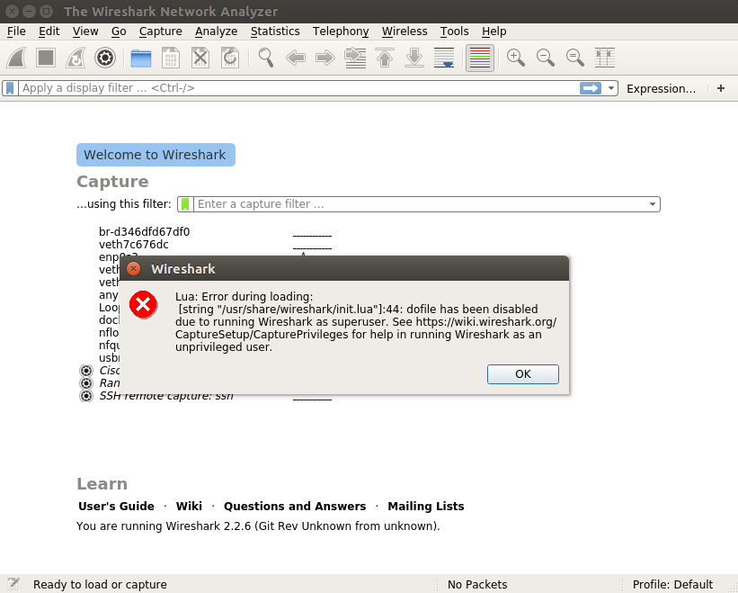
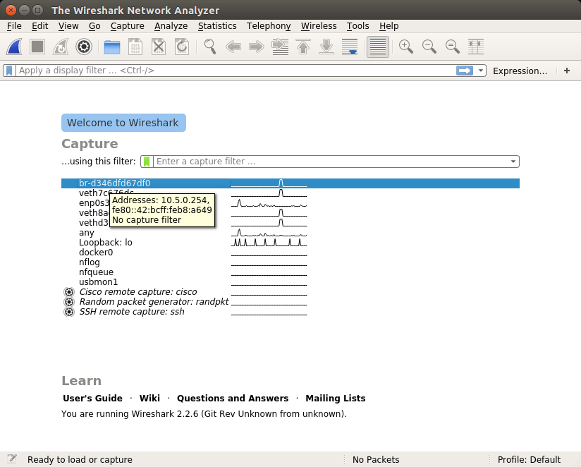
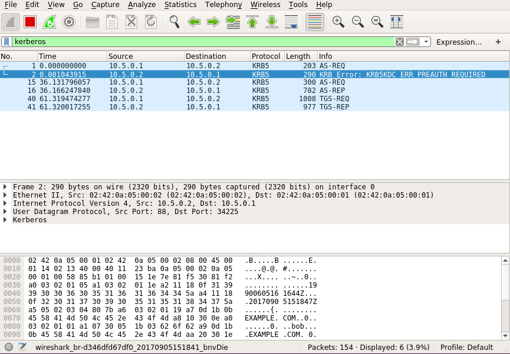

# README - network-analyser

You can install directly `wireshark` and `tshark` without creating docker image and container:

For ubuntu:

~~~
sudo apt-get -y install wireshark tshark
~~~

To use docker image and container do:

First create the docker image `network-analyser`:

~~~
./build-network-analyser.sh
~~~

Then create a docker container on the fly to launch `network-analyser`:

~~~
./analyse-network.sh
~~~

Then click OK on this warning:

  

Choose network interface of gateway of `example.com` at `10.5.0.254` with `ifconfig` or on hover mouse:

  

You can use filter to see kerberos protocol:

  

See:

* https://www.wireshark.org/docs/dfref/k/kerberos.html
